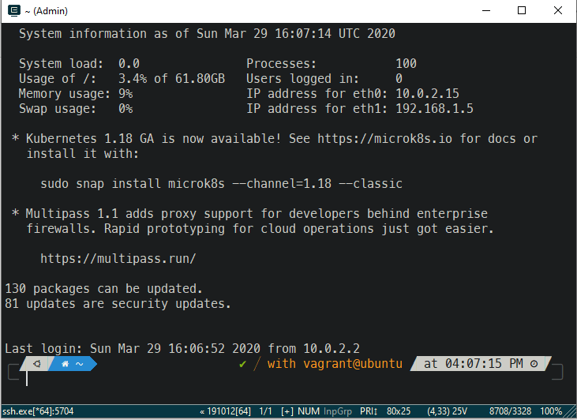
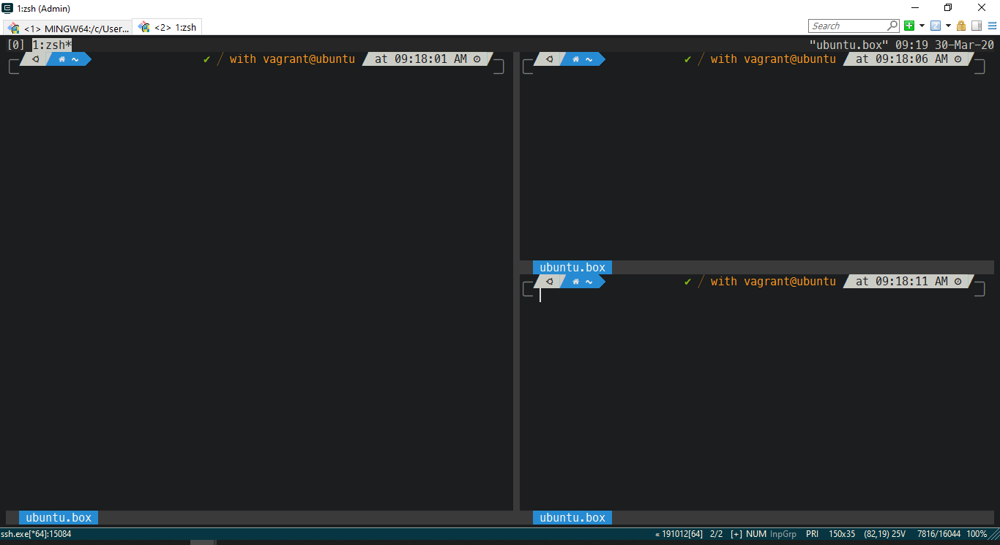

# Vagrant box Ubuntu-18.04
##  Release 0.0.1 can be used
## installed packages
1. zsh
    1. oh-my-zsh plugin
    2. powerlever10k
    3. auto-suggestions
    4. auto-completion
    5. you should use
2. tmux

## Pre-requiste on host
1. git bash (git bash comes with git installation)
2. Vagrant 
3. Virtual Box (5.2.38)
4. conEmu

## How to create Vagrant box(on host)
1. git clone code for creating vagrant box
```
git clone https://github.com/patilvinay/vagrant-ubuntu-18.04.git
git checkout 0.0.1 
you can use the latest release

```
2. cd vagrant-ubuntu-18.04
3. vagrant up

## Other settings on host

1. Use the ConEmu.xml file as a preference setting for ConEmu
2. Install the font 'MesloLGS NF Regular.ttf'. just right click and select install.

These files are provided in assets directory
## vm zsh looks like this

## vm tmux looks link this



